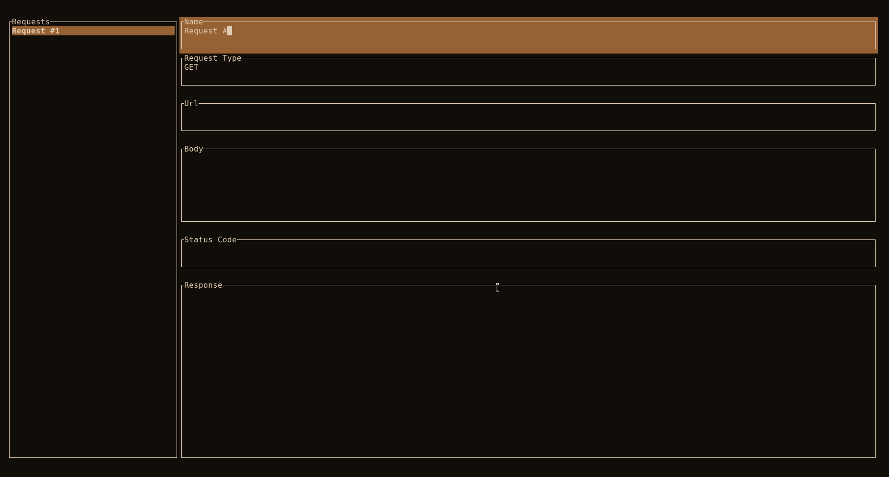

# Almagro
Almagro is a simple TUI application for making HTTP requests and viewing the
response. I started developing it when I wanted a terminal/keyboard based small
version of [Postman](https://postman.com/) with Vim keys for testing REST APIs at my job. It is still a
work in progress and has many features I'd like to add.

## Features
* Requests are saved in a JSON database (located at `~/.almagro/data.json`) so they persist on program restart
* All HTTP request types are supported
* Response status code and response body are viewable
* Create/Delete unlimited requests and move them in the list

## Dependencies
* [Cargo](https://doc.rust-lang.org/cargo/) - For building

## Building
The project has currently been tested on Linux, other platforms are untested.

1. `git clone` the repository
2. `cd` to it
3. `cargo build --release`
4. The binary will be at `target/release/almagro`

## Usage
* Use `n` to create a new request and `x` to delete the currently selected one
* Use `h` and `l` to navigate between the request list and request info panel
* Use `j` and `k` to navigate up and down
* Use `i` to enter insert mode when selecting an editable request attribute
  * Press `Enter` to save your changes or `Esc` to cancel and go back to normal mode
* Press `Enter` in normal mode to run the currently selected request
* When in the request list, use `Shift + j` or `Shift + k` to move the selected request up and down the list
* Use the `arrow keys` to scroll through the response body

## TODO
* Improve the editing component to allow newlines
* Make running requests non-blocking
* Allow scrolling through all text boxes
